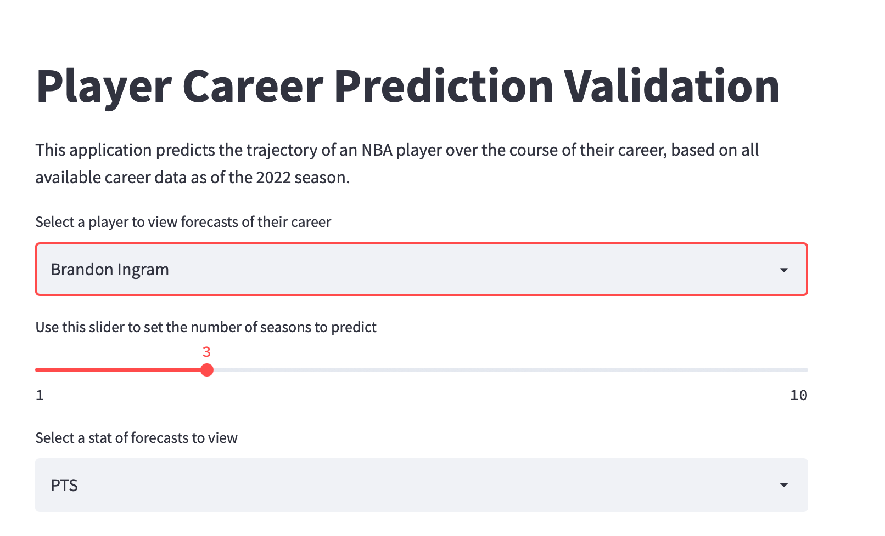
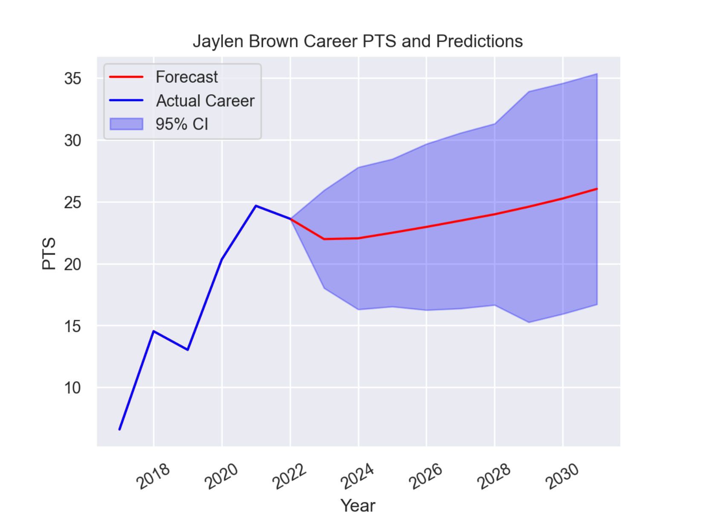

# NBA-Forecasting

## Background 
This repo contains code from an independent project where
I predict NBA player career using LSTM recurrent neural networks. 

Code was revisited and cleaned in January 2023. 

The basic idea is that a career is a time series of vectors 
`X_1, X_2, ...., X_N` where `X_j` is a `k` dimensional vector 
of points, rebounds, and other statistics that measure performance 
over the course of a season. My goal is sequence prediction - 
given observations `X_1, ..., X_p` I want to predict
`X_p+1, ..., X_N` to determine how a career changes over time. The 
vector prediction nature of the problem lends itself to recurrent neural networks. 


## Setup

Modeling was done using `python 3.7.15` and virtual
environments were managed using `conda`.

Requirements are stored in `requirements.txt` 

I found it easiest to install deps with both `pip` (out of habit)
and `conda` (to circumvent long `tensforflow` compilation / builds from scratch)
. 

To install deps and build the environment, run `source install.sh`in a terminal shell. 

The repo is set up as a python package, to make imports between
modules easier. 

## Running

To make forecasts (after installing), run
```
conda activate nba_forecasting && streamlit run app.py
``` 


The application should look something like this:




**Note** The LSTM struggles to handle the career progression of star players
(Lebron James, Joel Embiid etc). In particular, if a player performs at a high
level (e.g. 25 points per game), the model may project that in 5 years, he will
average 50 points per game which is highly unrealistic. This is an area
for future improvement. To see an example, use the "PTS" stat (points per game)
for Lebron. 

For more validation of the model, including 
performance comparison against a baseline model, look [here](forecasting/training/README.md).

## Future Steps

Future work here should: 
1. Better handle aging of players
    1. Could be solved by adding longer lookback to batch generator in training
   2. Could also be solved by adding more hyperparameters
2. Better tune hyperparameters 
3. Add non parametric confidence intervals to the predictions. 