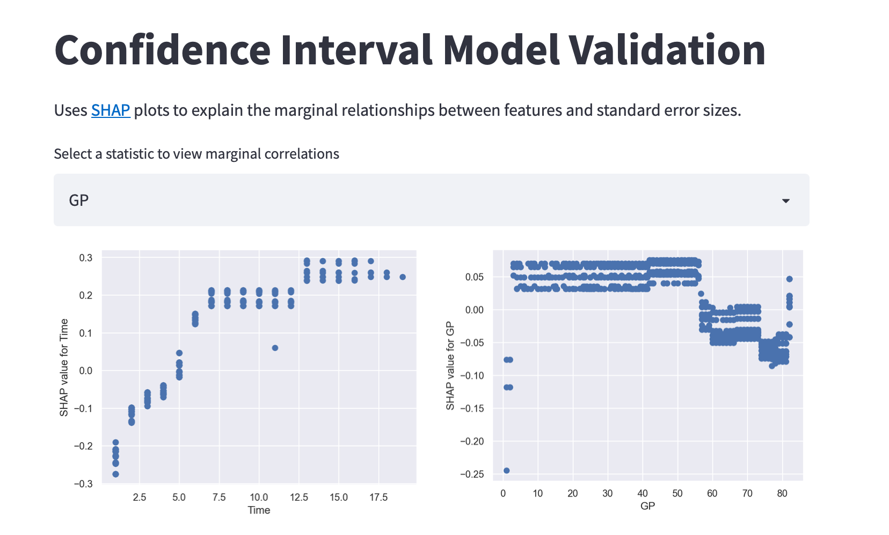

# Confidence Intervals

## Theory

I've found it easiest to approach confidence intervals from a single feature perspective. I might change this over time, but for now, this suffices as a first pass. 

Suppose we are trying to predict $X_t | X_{t-1}$. The simplest formulation would be something like this

$$ x_t = f(x_{t-1}, t) + \sigma(x_{t - 1}, t)\epsilon $$

Where $\epsilon \sim N(0, 1)$

We can fit $\hat{f}(x_{t-1}, t)$ on the training set, and on the validation set, write the following

$$  Z = log(|x_t - \hat{f}(x_{t-1}, t)|) = log(\sigma(x_{t-1}, t)) + log(\epsilon) $$

If we can train a model, $g(x_{t-1}, t)$ to predict $Z$, then we should have

$$ exp(\hat{Z}) = \hat{\sigma}(x_{t-1}, t) \approx \sigma(x_{t - 1}, t) $$

From here, we can build confidence intervals. 

## Application

Confidence intervals are constructed using standard errors from the validation set. To see models, $f$, run the application. This application leverages [SHAP](https://shap.readthedocs.io/en/latest/) to build explainable confidence interval models. 

SHAP attempts to estimate the marginal contribution of features on a prediction using game theory. A plot of SHAP values for a single feature highlights that feature's expected marginal contribution for all players, "integrated" over all values at each point 
(I place integrated in quotes because the viewer inherently integrates the SHAP scatter plot when viewing. No
integration actually happens, but the shape of the plot should be interpreted as an integral).

A SHAP plot that increases can be read as a positive marignal effect in the model whereas a flat SHAP plot can be read as no effect. The magnitude of SHAP values corresponds to the effect size. 

To run the app, simply run `streamlit run app.py`. 

Observe how SHAP values vary for both the statistic of interest and over time, generally growing over time. 
This corresponds to different statistic ranges having different eases of prediction with error increasing over time.

The app should look something like this

