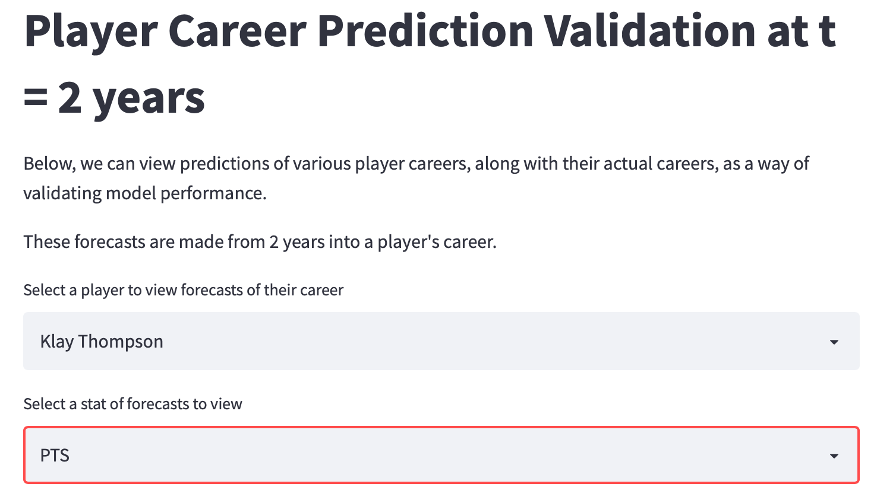
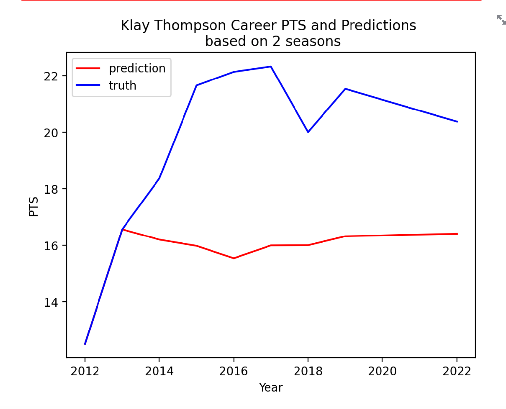

# Model Training 

Here, I train the LSTM. `model.py` contains the LSTM architecture
and `train.py` is the training script. 

Note that at this point, I don't tune hyperparameters. I may 
return to this at a later point in development. I have generally
found that hyperparameter tuning can have pretty marginal impact
on model outcome, although that does change with neural networks. I'd
want to tune network depth / number of parameters and maybe dropout rate. Additionally,
given the amount of compute I have, complex hyperparameter
searches take prohibitively long. 

## Validation Loss 

Validation MSE decreases as a function of epoch, which 
is a promising sign that the model is indeed learning something. 
It also indicates that 30 epochs is roughly appropriate - 
the curve tends to flatten around epoch 20.

## Forecasts

Use the streamlit app to validate model forecasts with
actual player performance - to do this, run 
`streamlit run app.py` in the terminal. You'll see something
that looks like the following:

## Statistical Comparison

Additionally, I compare errors to a null baseline. I define a statistic, which I call
`T`, as the average RMSE between career predictions and true career 
outcomes, averaged over all seasons for a player and averaged over 
all players. 

I define a "null distribution" as the distribution generated 
by sampling randomly from the training set. In other words,
this gives an estimate of how much better, or worse, 
than random I am. 

More rigorous baselines are always a good idea. That can come with time. 

